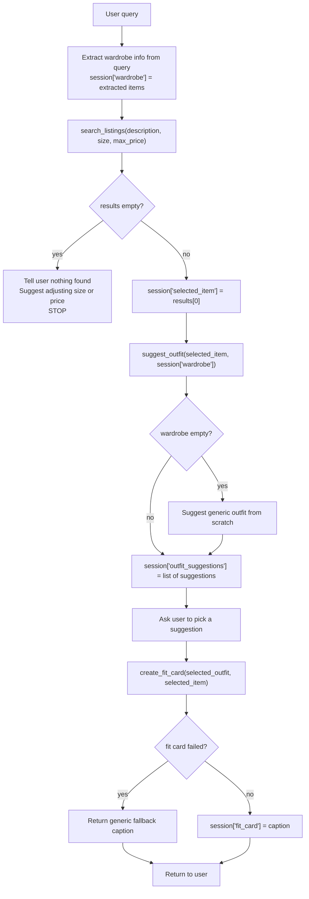

# FitFindr — planning.md

> Complete this document before writing any implementation code.
> Your spec and agent diagram are what you'll use to direct AI tools (Claude, Copilot, etc.) to generate your implementation — the more specific they are, the more useful the generated code will be.
> Your planning.md will be reviewed as part of your submission.
> Update it before starting any stretch features.

---

## Tools

List every tool your agent will use. For each tool, fill in all four fields.
You must have at least 3 tools. The three required tools are listed — add any additional tools below them.

### Tool 1: search_listings

**What it does:**
This tool searches through a dataset of clothing listings for an item that user wants.

**Input parameters:**
<!-- List each parameter, its type, and what it represents -->
- `description` (str): user gives it a description of an item they want (string). It helps to determine which item to find.
- `size` (str, optional): the size to filter by. If not provided, the results are not filtered by the size
- `max_price` (float, optinal): the price to filter by (results must be less than max_price). If not provided, the results are not filtered by the price

**What it returns:**
A list of items that match input requirements

**What happens if it fails or returns nothing:**
Tell the user nothing was found and stop completely, don't move on to suggest_outfit

---

### Tool 2: suggest_outfit

**What it does:**
It takes the item found in the search_listings, and compares it against the user's existing wardrobe. Then it suggests how to wear item (e.g. jeans+shirt)

**Input parameters:**
<!-- List each parameter, its type, and what it represents -->
- `new_item` (dict): Use new_item[0]. It is a new item that was previously found and returned from search_listings. 
- `wardrobe` (dict): existing wardrobe that user has so that it can suggest the outfit pairing a new item with existing clothes

**What it returns:**
a list of suggestions on how to pair the new item with the existing items

**What happens if it fails or returns nothing:**
Do not crash or stop. If the user has no wardrobe, it should suggest an outfit from scratch (if the new item is a t-shirt, and the user's wardrobe is empty, it should say something like "pair this t-shirt with jeans and sneakers")

---

### Tool 3: create_fit_card

**What it does:**
Generates a short description of a complete outfit, the kind that somone would caption a social media post with.

**Input parameters:**
<!-- List each parameter, its type, and what it represents -->
- `outfit` (list of suggestions): a list of existing outfit suggestions provided so that the tool can take it and generate the caption. Ask the user first which suggestion out of the outfit list it should use to create a caption
- `new_item` (dict): Use new_item[0]. It is a new item that was previously found and returned from search_listings. 

**What it returns:**
Returns a string containing a short description of a complete outfit suitable for social media

**What happens if it fails or returns nothing:**
It shouldn't crash, but rather return something generic: "just thrifted this [new item] - love it!".

---

### Additional Tools (if any)

---

## Planning Loop

**How does your agent decide which tool to call next?**
After search_listings runs, check if results is empty. If yes, set an error message in the session and return early. If no, set selected_item = results[0] and proceed to suggest_outfit. After suggest_outfit runs, check if the list of suggestions is empty or if there was any error. If yes, return a generic suggestion "pair this [new item] with [find most popular items to pair it with on internet]", and return that instead. If no, return a list of suggested outfits (e.g. ["pair this t-shirt with jeans", "pair this t-shirt with a skirt", ...]). When create_fit_card runs, ask user which outfit suggestion out of the list of outfits they like the most. After the function runs, check if it crashed or something went wrong before returning. If yes, return something generic: "just thrifted this [new item] - love it!". If not, return the full caption incorporating the outfit.

---

## State Management

**How does information from one tool get passed to the next?**
<!-- Describe how your agent stores and accesses state within a session. What data is tracked? How is it passed between tool calls? -->

There is a going to be a dictionary withing the session that tracks state during one conversation. It would track selected_item, outfit_suggestions, fit_card, and wardrobe:
session = {
    "selected_item": None,
    "outfit_suggestions": [],
    "fit_card": None,
    "wardrobe": {}
}

the agent will extract wardrobe from the user query and write to session["wardrobe"]. search_listings will write to session["selected_item"], suggest_outfit reads from session["selected_item"] and writes to session["outfit_suggestions"], and fit_card reads from session["outfit_suggestions"] and writes into session["fit_card"]
---

## Error Handling

For each tool, describe the specific failure mode you're handling and what the agent does in response.

| Tool | Failure mode | Agent response |
|------|-------------|----------------|
| search_listings | No results match the query | Tell user: "no matching results were found, please try adjusting size or price", and then stop the loop |
| suggest_outfit | Wardrobe is empty | Suggest a generic outfit from scratch without using wardrobe: "pair this [new item] with [items it is usually paired with]" |
| create_fit_card | Outfit input is missing or incomplete | Return generic fallback: "just thrifted this [new item] - love it!" |

---

## Architecture

<!-- Draw a diagram of your agent showing how the components connect:
     User input → Planning Loop → Tools (search_listings, suggest_outfit, create_fit_card)
                                                                          ↕
                                                                   State / Session
     Show what triggers each tool, how state flows between them, and where error paths branch off.
     ASCII art, a Mermaid diagram (https://mermaid.js.org/syntax/flowchart.html), or an embedded
     sketch are all fine. You'll share this diagram with an AI tool when asking it to implement
     the planning loop and each individual tool. -->

---

## AI Tool Plan

<!-- For each part of the implementation below, describe:
     - Which AI tool you plan to use (Claude, Copilot, ChatGPT, etc.)
     - What you'll give it as input (which sections of this planning.md, your agent diagram)
     - What you expect it to produce
     - How you'll verify the output matches your spec before moving on

     "I'll use AI to help me code" is not a plan.
     "I'll give Claude my Tool 1 spec (inputs, return value, failure mode) and ask it to implement
     search_listings() using load_listings() from the data loader — then test it against 3 queries
     before trusting it" is a plan. -->

**Milestone 3 — Individual tool implementations:**
Claude: I will give it section "tools" from planning.md (tool 1, tool 2, and tool 3 - individually). For tool 1, I will say it has to write the code for "search_listings" using load_listings() from the data loader. I will test it on 3 different queries. For tool 2, I will say it has to implement "suggest_outfit" and use Groq's llama-3.3-70b-versatile. It should not crash if the wardrobe is empty. If it is empty, it should search for similar items that get paired with "new_item" and suggest that instead. I will test it on different inputs and make sure that the responses make sense (make sure it doesnt pair jeans and a skirt, for example). For tool 3, I will say it has to implement "create_fit_card" and use Groq's llama-3.3-70b-versatile again. It needs to guard against the empty 'outfit' string: if it's empty, it should use "new_item" that we returned from tool 1 and return a generic caption: "just thrifted this [new_item from tool 1] - love it!". I will test this tool on different inputs and make sure that the outputs are different for different inputs.

**Milestone 4 — Planning loop and state management:**
Claude:  I will ask it to connect my tools between each other and test that states pass correctly between tools. I will give it Planning Loop and State management sections from planning.md. Then I will ask it to implement run_agent(). It should give me the code that calls each tool (search_listings, suggest_outfit, and create_fit_card) and store the result of each in the session. When calling tool 2 and tool 3, make sure that they take the result of the previous tool stored in session. I will verify the output by running it multiple times with multiple different inputs and verifying that: if search_listings returns empty, then reflect an error message and stop completely; make sure the patrameters get passed correctly between functions (can you print statements to check that); and that different inputs return different results.
---

## A Complete Interaction (Step by Step)

Write out what a full user interaction looks like from start to finish — tool call by tool call. Use a specific example query.

**Example user query:** "I'm looking for a vintage graphic tee under $30. I mostly wear baggy jeans and chunky sneakers. What's out there and how would I style it?"

**Step 1:**
<!-- What does the agent do first? Which tool is called? With what input? -->
Extract wardrobe information from the user's query — baggy jeans and chunky sneakers — build a wardrobe dict, then store it in session['wardrobe']. Call search_listings with inputs description("vintage graphic tee"), size(None), max_price(30). Output is an array called results with items that match the description and the max price.

**Step 2:**
<!-- What happens next? What was returned from step 1? What tool is called now? -->
Step 1 returned an array of matching results. We take the first one at index 0. Then we call suggest_outfit with inputs new_item(results[0]), wardrobe. It returns an array of suggested outfits = ["pair this vintage baggy tee with baggy jeans and chunky sneakers"] of size 1 because the user gave us a limited wardrobe.

**Step 3:**
Ask user which suggestion they want. User picks index 0. Then call create_fit_card with outfit(outfit_suggestions[0]) and new_item(session["selected_item"])". Check for successful completion. It returns a caption "Thrifted this vintage graphic tee that fits so well with my baggy jeans and sneakers. Love it!!!". 

**Final output to user:**
<!-- What does the user actually see at the end? -->
The user sees the fit card caption: 'Thrifted this vintage graphic tee that fits so well with my baggy jeans and sneakers. Love it!!